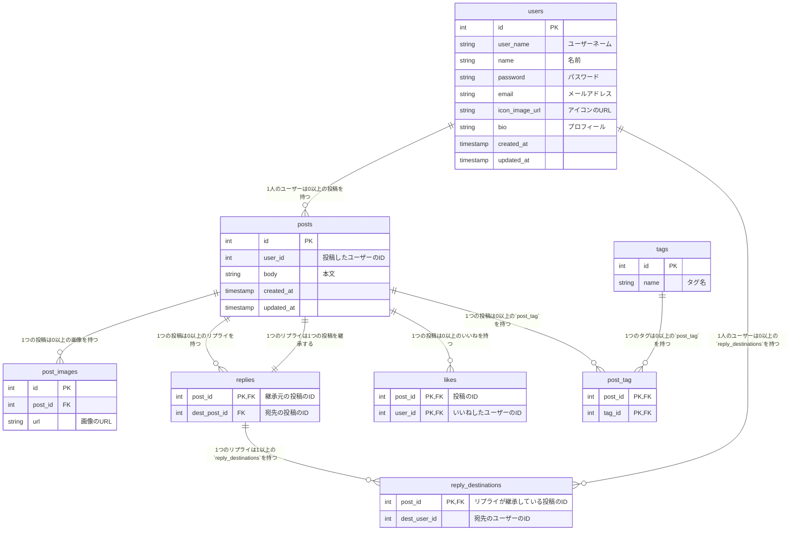

# TuneTrail

## 使用技術

| 技術       | 詳細                         |
| :--------- | :--------------------------- |
| Next.js    | フロントエンドフレームワーク |
| TypeScript |                              |


バックエンド
| 技術       | 詳細              |
| :--------- | :---------------- |
| Go 1.20.3  | APIサーバー       |
| Gin        | Webフレームワーク |
| PostgreSQL | RDB               |

インフラ
| 技術          | 詳細                                                                     |
| :------------ | :----------------------------------------------------------------------- |
| ECS (Fargate) | コンテナの管理                                                           |
| Route 53      | 独自ドメインを登録する目的                                               |
| S3            | 画像の保存                                                               |
| Docker        | リリース時のコンテナイメージを軽量にする目的でマルチステージビルドを採用 |
| Terraform     | インフラのコード化                                                       |

## ER図



## 環境構築

externalなネットワークを作成します。

```
docker network create tunetrail-external
```

docker-composeで各コンテナを起動します。

```
docker compose up
```
### バックエンド

VSCodeのコマンドパレットで**Dev Containers: Open Folder in Container**を実行し、`api`ディレクトリを選択します。

### フロントエンド

VSCodeのコマンドパレットで**Dev Containers: Open Folder in Container**を実行し、`frontend`ディレクトリを選択します。
